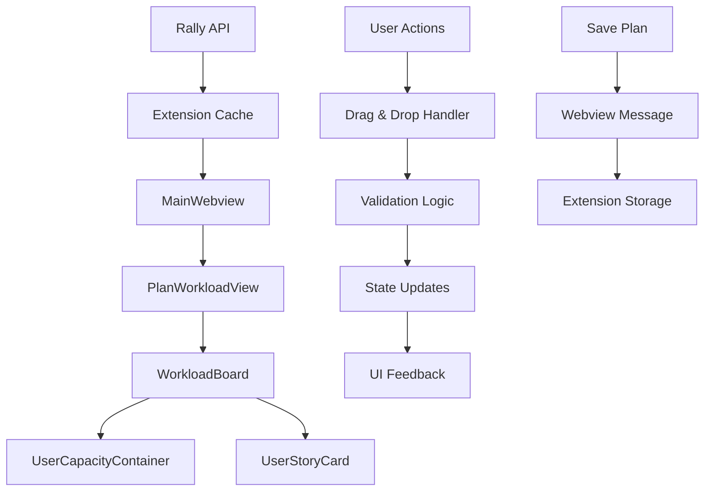

## Arquitectura General

El sistema es implementarà com una nova vista "Plan" integrada dins del MainWebview, reutilitzant l'arquitectura existent de React i les dades de Rally.

### 1. Components Principals

**PlanWorkloadView** - Component principal que gestionarà l'estat de la planificació

- **WorkloadBoard** - Tauler principal amb contenidors per cada usuari
- **UserStoryCard** - Targetes arrossegables amb amplada proporcional a planEstimate
- **UserCapacityContainer** - Contenidors que representen la capacitat de cada usuari
- **WorkloadCalculator** - Utilitats per càlculs de distribució i validacions

### 2. Estat i Dades

Utilitzarà les dades Rally existents:

- `userStories` amb `planEstimate` (hores)
- `users` del projecte
- Estat local per la distribució actual

### 3. Interfície d'Usuari

- **Drag & Drop intuitiu** amb feedback visual
- **Validacions automàtiques** de sobrecàrrega (vermell) i subutilització (groc)
- **Controls per**:
  - Auto-distribució equilibrada
  - Reset de planificació
  - Export de pla
  - Guardar/carregar plans

### 4. Integració amb Extensió

- **Nova pestanya** al NavigationBar del MainWebview
- **Missatges webview** per persistència d'estat
- **Comandaments** nous: `robert.openPlanningView`, `robert.saveWorkloadPlan`

## Flux de Dades



## Implementació Tècnica

### Tecnologies Utilitzades

- **React** (ja disponible)
- **styled-components** (ja disponible)
- **React DnD** (nova dependència per drag-and-drop)
- **Arquitectura existent** de webviews i missatges

### Estructura de Fitxers

```
src/webview/components/
├── PlanWorkloadView.tsx          # Component principal
├── common/
│   ├── WorkloadBoard.tsx         # Tauler drag-and-drop
│   ├── UserCapacityContainer.tsx # Contenidor per usuari
│   ├── UserStoryCard.tsx         # Targeta arrossegable
│   └── WorkloadCalculator.ts     # Lògica de càlculs
```

### Validacions i Regles

- **Capacitat per defecte**: 40 hores/sprint (configurable)
- **Validacions visuals**:
  - >100% capacitat = vermell
  - 80-100% = groc
  - <80% = verd
- **Auto-distribució**: algoritme simple de distribució proporcional

### Persistència

- **Estat local** durant la sessió
- **Guardar plans** a settings de VS Code
- **Export** a formats JSON/CSV per compartir