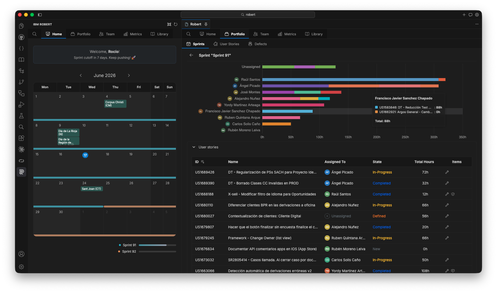
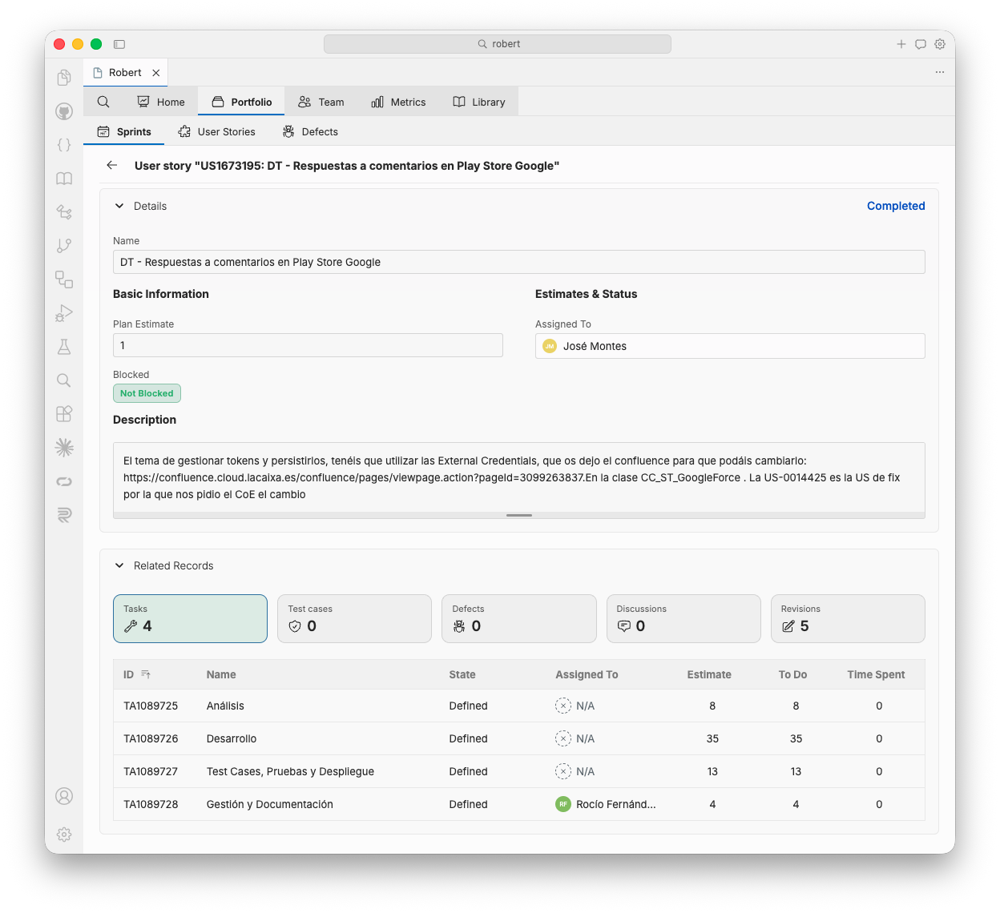
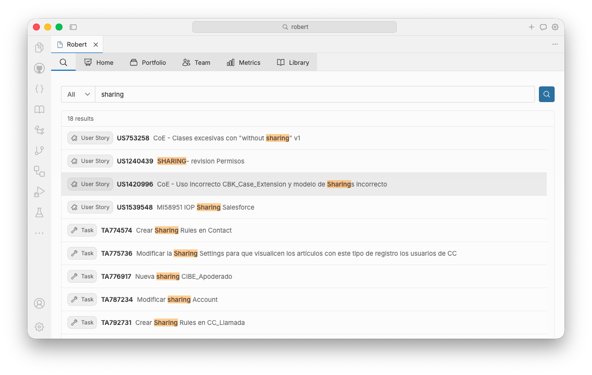
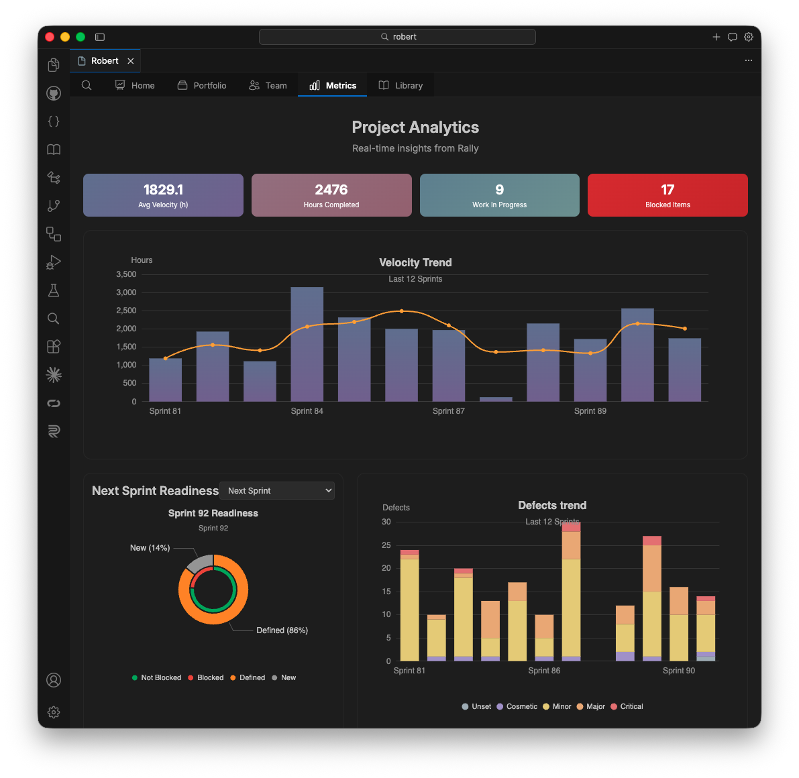

##  IBM Robert

**IBM Robert** is a VS Code extension that brings Rally Agile project management into your editor. Track sprints, user stories, defects, and team workload without leaving VS Code — with dashboards, search, and analytics built for day-to-day delivery work.

---

## What you can do with Robert

### Home — your sprint at a glance

The Home view welcomes you with a personalized dashboard: current sprint countdown, a monthly calendar with active sprints and regional holidays, and quick access to sprint details.

Open any sprint to see resource allocation per team member, user stories with state and hours, and a clear picture of who is working on what.

### Portfolio — user stories and defects

Browse work by sprint or across the full backlog. Open any user story to see its description, assignment, estimates, and related records — tasks, test cases, defects, discussions, and revisions — all in one place.

### Search — find anything fast

Search across user stories, tasks, and other Rally artifacts. Results are grouped by type, with keyword highlighting so you can jump straight to the item you need.

### Metrics — project analytics

The Metrics view provides real-time insights from Rally: velocity trends, hours completed, work in progress, blocked items, next-sprint readiness, and defect trends by severity over the last 12 sprints.

### Team

See each team member's progress for the current or past sprints — completed hours, total allocation, and linked user stories — to balance workload and spot bottlenecks early.

### Library

Access built-in tutorials and guides to get the most out of Robert and Rally workflows.

---

## Getting started

### Requirements

- Visual Studio Code 1.105.1 or later
- A Rally account with API access
- Your Rally project name

### Install

1. Install **IBM Robert** from the VS Code Extensions view, or install a `.vsix` package provided by your team.
2. Open the **IBM Robert** panel from the activity bar (left sidebar).
3. On first launch, configure your Rally connection (see below).

### Open Robert

- Click the **IBM Robert** icon in the activity bar, or
- Run **IBM Robert: Open Main View** from the Command Palette (`Cmd+Shift+P` / `Ctrl+Shift+P`).

You can also open Robert in a full editor tab via the **Open in Editor** button in the panel toolbar.

---

## Configuration

Connect Robert to your Rally instance once; settings are saved across sessions.

1. Open VS Code Settings (`Cmd+,` / `Ctrl+,`).
2. Search for **Robert**.
3. Set:
   - **Rally Instance URL** — e.g. `https://rally1.rallydev.com`
   - **Rally API Key** — your personal Rally API key
   - **Rally Project Name** — the project you work on

| Setting | Description |
|---------|-------------|
| Auto refresh | Keep data up to date automatically |
| Status bar sprint days | Show days left until sprint cutoff in the status bar |
| Welcome animation | Play the intro video on first open after reload |
| Collaboration | Optional real-time collaboration features (requires server URL) |
| Debug mode | Verbose logging to the Robert output channel |

---

## Navigation

Robert is organized around five main areas:

| Tab | Purpose |
|-----|---------|
| **Home** | Calendar, sprint overview, and sprint detail panels |
| **Portfolio** | User stories and defects by sprint or full list |
| **Team** | Per-member workload and progress |
| **Metrics** | Velocity, readiness, and defect analytics |
| **Library** | Tutorials and onboarding content |

Use the search icon in the top bar to find work items across the project.

---

## Tips

- **Reload data** — use the refresh button in the panel toolbar or run **IBM Robert: Reload**.
- **Status bar** — when enabled, shows how many days remain until the current sprint cutoff.
- **Output log** — if something looks wrong, open **View → Output → Robert** or run **IBM Robert: Show Robert Output**.

---

## Troubleshooting

| Issue | What to try |
|-------|-------------|
| Blank or empty view | Run **IBM Robert: Reload**, or restart VS Code |
| No data / connection errors | Check Rally URL, API key, and project name in Settings |
| Stale information | Enable auto refresh, or use the reload button |

Enable **Debug mode** in Settings for more detail in the Robert output channel.

---

## License

See [LICENSE.md](LICENSE.md) for details.
